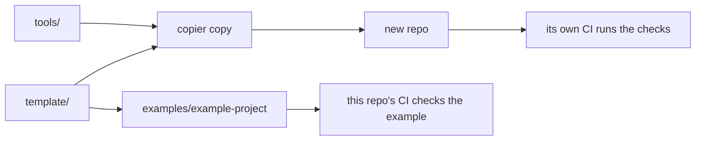

# ds-project-standard

A Copier template for data science repos, with checks for sourced numbers, plain writing and links.

## In plain words

This repo makes the starting files for each of my data science projects. Every new
project gets the same docs, the same tests and the same checks in CI. The checks stop a
build when a number has no source, when a page is hard to read, or when a link is
broken.

## Try it

You need [uv](https://docs.astral.sh/uv/) and [Copier](https://copier.readthedocs.io/).

```bash
copier copy --trust gh:Iliya-Valizadeh/ds-project-standard my-repo
cd my-repo
uv sync
uv run pytest
```

Copier asks a few questions (repo name, one-line summary, author, whether there is a
model or a data set) and writes the files. `--trust` lets it run `uv lock` at the end, so the new repo has a
lockfile from the start. To bring an existing generated repo up to date, run
`copier update --trust` inside it.

To work on the template itself:

```bash
uv sync
uv run pytest
uv run python scripts/example.py check --eval
```

## Result

There is no model result here. What this repo shows is that the template works: CI
renders the template again on every push and compares it with the committed example in
[`examples/example-project/`](examples/example-project/). CI then runs that example's
own lint, tests, docs checks and demo. The worked example inside it uses synthetic data,
so its numbers only show that the pipeline runs. They say nothing about any real
problem.

## How I worked

- The rules come first, in [`STANDARD.md`](STANDARD.md). Each rule has one line on why
  and a link to its source.
- Each design choice has a short decision record in
  [`docs/decisions/`](docs/decisions/), with the options I did not take.
- The repo scores itself against the ML Test Score in
  [`docs/ml_test_score.md`](docs/ml_test_score.md). It scores zero overall today, and
  the page says why.

## How it works



- `template/` holds every file a new repo gets, as Jinja templates.
- `tools/` holds the checks. The template copies them into each repo, so there is one
  source for them.
- `copier.yml` holds the questions Copier asks and runs `uv lock` after generation.
- `scripts/example.py` renders the template into `examples/` and fails if the result
  differs from the committed copy.
- `.github/workflows/ci.yml` runs the tool tests, the example check and a web link check.

## What's weak

- `STANDARD.md` is still a draft. Iliya has not yet edited it into his own words.
- The ML Test Score self-assessment was written before CI first ran on GitHub. It needs
  a new score now that CI runs.
- The worked example is a toy on synthetic data. It proves the files and checks work
  together, not that any model is good.
- The readability check uses a reading-grade formula. Such formulas count words and
  syllables, so they can pass text that is still unclear.

## Docs

- Tutorial: the "Try it" section above.
- How-to: [`tools/README.md`](tools/README.md) shows how to run each check.
- Reference: [`STANDARD.md`](STANDARD.md) lists every rule and where it comes from.
- Explanation: [`docs/decisions/`](docs/decisions/) records why the template works the
  way it does.

## Repo map

<!-- repo-map:start -->
| Path | What it holds |
|---|---|
| `.github/` | CI workflows and GitHub settings |
| `copier.yml` | Copier questions and the task that runs after generation |
| `docs/` | Decision records, the ML Test Score self-assessment and the social preview |
| `examples/` | A repo made from the template, checked for drift in CI |
| `scripts/` | Renders the example again and checks it for drift |
| `STANDARD.md` | The house rules on one page |
| `template/` | Every file a new repo gets |
| `tests/` | Tests for the tools, the template and the example |
| `tools/` | The checks, copied into each new repo |
<!-- repo-map:end -->
